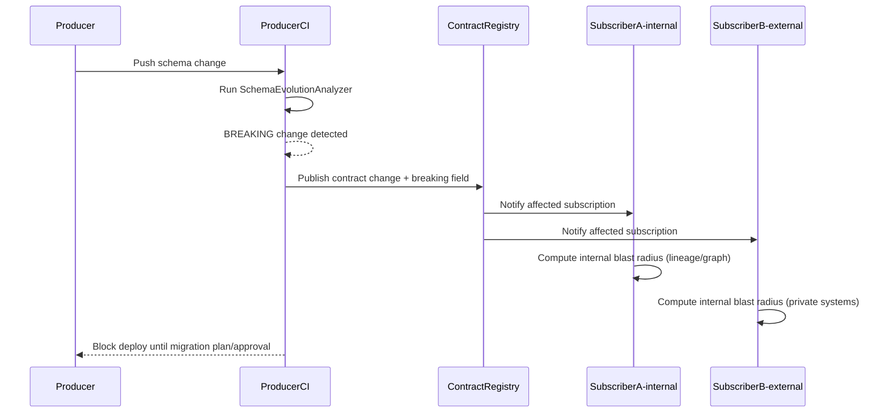

# DOMAIN_NOTES

This document answers the five required Phase 0 questions using evidence from the current Week 7 workspace outputs:

- `outputs/week1/intent_records.jsonl` (20 records)
- `outputs/week2/verdicts.jsonl` (10 records)
- `outputs/week3/extractions.jsonl` (50 records)
- `outputs/week4/lineage_snapshots.jsonl` (1 snapshot, 76 nodes, 46 edges)
- `outputs/week5/events.jsonl` (1847 records)
- `outputs/traces/runs.jsonl` (237 trace records)

The examples below are from those files, not hypothetical examples.

## 1) Backward-compatible vs. breaking schema change (with 3 examples each)

A backward-compatible change preserves existing consumers that are built against the previous contract. A breaking change invalidates one or more existing consumer assumptions.

Backward-compatible examples from this project:

1. Week 3 extraction record: adding optional `reviewed_by` at top level in `outputs/week3/extractions.jsonl` while keeping current required keys (`doc_id`, `source_hash`, `extracted_facts`, `entities`, etc.) unchanged.
2. Week 5 event record: adding a new optional metadata key like `metadata.request_id` while keeping existing required metadata keys (`correlation_id`, `user_id`, `source_service`) and required top-level event keys unchanged.
3. LangSmith trace record: adding an optional `provider_latency_ms` numeric field while preserving current fields (`id`, `run_type`, `inputs`, `outputs`, `start_time`, `end_time`, `total_tokens`, `total_cost`, etc.).

Breaking examples from this project:

1. Week 3 extraction record: changing `extracted_facts[].confidence` from float `0.0-1.0` to percentage `0-100` (the exact failure mode called out by the challenge).
2. Week 5 event record: renaming `event_type` to `event_name` without dual-write alias period. Any consumer routing by `event_type` breaks immediately.
3. Week 2 verdict record: changing score range from integer `1-5` to `0-100` without updating validators and weighted scoring logic. Existing score checks fail and score interpretation changes.

Why these are real examples: the current datasets already enforce these assumptions. For example, Week 5 currently depends on `event_type` values like `AgentNodeExecuted`, `AgentToolCalled`, and `DocumentUploadRequested`, and Week 2 uses `overall_verdict` enum values `PASS|FAIL|WARN`.

## 2) Week 3 confidence change (0.0-1.0 -> 0-100), failure path into Week 4, and Bitol clause

Evidence from the current Week 3 output:

- records: 50
- extracted facts: 342
- confidence min: 0.84
- confidence max: 0.86
- confidence mean: 0.851696

If we apply the bad transformation `confidence = confidence * 100`, the same data becomes:

- min: 84.0
- max: 86.0
- mean: 85.169591

This is a semantic break, even if all values are still numeric.

Failure path:

1. Producer change in Week 3 emits percentage confidence (`84.0`, `85.0`, `86.0`) instead of normalized confidence (`0.84`, `0.85`, `0.86`).
2. Week 4 or any downstream ranking/threshold logic interprets confidence as normalized probability and over-trusts records.
3. Contract checks that only validate numeric type will pass, so the error can become silent.
4. Contract checks with range + drift checks fail and block propagation.

Bitol-compatible clause that catches it before propagation:

```yaml
apiVersion: v3.0.0
kind: DataContract
id: week3-document-refinery-extractions
dataset:
  name: week3_extractions
clauses:
  - id: week3.extracted_facts.confidence.range
    category: quality
    severity: error
    description: Confidence must be normalized to a 0.0-1.0 float scale.
    rule:
      type: numeric_range
      field: extracted_facts.confidence
      minimum: 0.0
      maximum: 1.0
  - id: week3.extracted_facts.confidence.drift
    category: statistical
    severity: warn
    description: Detect distribution drift against baseline confidence mean/stddev.
    rule:
      type: statistical_drift
      field: extracted_facts.confidence
      warn_stddev: 2
      fail_stddev: 3
```

The range clause catches the direct 0-100 mistake. The drift clause catches subtler semantic shifts that may still fit type checks.

## 3) How Week 4 lineage is used for blame chains (step by step + traversal logic)

The current implementation is in `contracts/attributor.py`. In the Tier 1 implementation, blast radius is computed transitively across the local contract graph, and Week 4 lineage is used as file-level graph enrichment when contract seeds can be matched to concrete nodes.

Observed lineage evidence from `outputs/week4/lineage_snapshots.jsonl`:

- snapshot id: `6d75c325-c364-5a5d-afe2-fa65b4d470ac`
- 76 nodes and 46 edges
- edges use relationships such as `CONSUMES` and `PRODUCES`
- nodes include typed IDs like `transform::...` and `dataset::...`

### Q3 Trust Boundary Sequence Diagram



Key trust-boundary point: SubB is external. We do not traverse external lineage; we notify via registry and the external consumer computes impact internally.

### Actual attribution flow in this repo

1. Load validation report JSON and isolate failing checks (`FAIL`/`ERROR`).
2. Build the internal same-team dependency graph from registry subscriptions and traverse it to full transitive depth from the failing producer contract.
3. Load latest Week 4 lineage snapshot and, when contract seeds resolve to concrete nodes, traverse that graph for additional upstream/downstream detail and candidate-file confidence.
4. Infer candidate files from failing field:
   - tokenize `column_name` into keywords
   - scan lineage nodes for keyword matches in `node_id`, `metadata.path`, or label
   - if no match, apply dataset hints (`extract/entity` -> week3, `event/sequence` -> week5, etc.)
   - add special-case candidates from report context (for violated datasets)
5. Keep only existing paths and deduplicate.
6. Build blame chain entries:
   - fetch recent git commits (`git log --follow ...`) when available
   - fallback to deterministic workspace commit metadata if git context is missing
   - compute confidence score by rank and graph hop count (`1.0 - 0.2*hops - 0.05*(rank-1)`, floor `0.1`)
7. Write `violation_log/violations.jsonl` with:
   - transitive impacted subscribers and downstream contracts
   - candidate files
   - ranked blame chain
   - blast-radius metadata
   - git context

Traversal note: candidate-file selection is still heuristic node matching plus hint expansion and rank scoring, but blast-radius traversal itself now walks the internal contract graph to full transitive depth and uses BFS over the Week 4 lineage graph when anchor nodes are available.

## 4) LangSmith trace_record contract (structural + statistical + AI-specific clauses)

This contract targets the current trace export shape in `outputs/traces/runs.jsonl` (237 records, `run_type` currently all `chain`):

```yaml
apiVersion: v3.0.0
kind: DataContract
id: langsmith-trace-records
dataset:
  name: trace_record
fields:
  id:
    type: string
    required: true
    format: uuid
  run_type:
    type: string
    required: true
    enum: [llm, chain, tool, retriever, embedding]
  start_time:
    type: string
    required: true
    format: date-time
  end_time:
    type: string
    required: true
    format: date-time
  total_tokens:
    type: integer
    required: true
    minimum: 0
  total_cost:
    type: number
    required: true
    minimum: 0.0
clauses:
  - id: traces.end_after_start
    category: temporal
    severity: error
    rule:
      type: expression
      assertion: end_time >= start_time
  - id: traces.tokens.non_negative
    category: quality
    severity: error
    rule:
      type: numeric_range
      field: total_tokens
      minimum: 0
  - id: traces.tokens.drift
    category: statistical
    severity: warn
    rule:
      type: statistical_drift
      field: total_tokens
      warn_stddev: 2
      fail_stddev: 3
ai_extensions:
  - id: traces.llm_output_schema_violation_rate
    type: output_schema_violation_rate
    input_dataset: outputs/week2/verdicts.jsonl
    warn_threshold: 0.02
    fail_threshold: 0.05
```

Clause mapping:

- Structural: `run_type` enum and timestamp formats.
- Statistical: `total_tokens` drift check.
- AI-specific: explicit LLM output schema violation-rate metric from Week 2 verdict outputs.

## 5) Most common production failure mode, why contracts get stale, and how this architecture prevents it

Most common failure mode: the contract exists, but it is no longer synchronized with the producer and is not executed as a blocking operational gate. Teams then unknowingly normalize bad data behavior because validation is not active in the release path.

Why contracts become stale in practice:

1. Schema changes happen in feature branches, but contract updates are treated as optional docs work.
2. Validation results are not wired into CI or deployment decisions.
3. Drift checks are omitted, so semantic breaks (like scale changes) pass type checks.
4. Attribution is weak, so teams cannot quickly identify ownership and fix source systems.

How this project architecture addresses staleness:

1. Contract generation is data-driven from actual JSONL outputs, so refreshing contracts is operationally cheap.
2. Validation outputs are structured machine-readable JSON (`PASS/FAIL/WARN/ERROR per clause`) rather than prose, so they can gate automation.
3. Violation attribution links failing fields to candidate files and commit context, reducing mean time to diagnosis.
4. Schema snapshots plus diff classification make schema evolution explicit instead of implicit.
5. AI-specific checks extend coverage beyond classic tabular constraints:
   - trace schema integrity
   - output schema violation rate
   - embedding/prompt-oriented drift extensions

Concrete project example:

- The Week 3 confidence field is currently valid (`0.84-0.86`), but if a producer change shifts to `84-86`, type checks alone would miss semantic correctness.
- This architecture blocks that through explicit numeric range clauses and statistical drift checks, then creates a blame chain and blast-radius report so remediation can be assigned quickly.

In short, contracts stay fresh only when they are generated, validated, attributed, and reported as part of normal delivery operations. This repository is structured to make that workflow executable instead of manual.

## 6) Tier 1 interdependency map across the week systems and what LangSmith is logging

This repository treats the week projects as internal subsystems inside one Tier 1 platform. They were originally separate challenge outputs, but in this workspace they become interdependent when one week's artifacts are reused by another week's runtime, audit flow, event flow, or contract enforcement flow.

### Actual Tier 1 dependency map in this workspace

- Week 1 Intent-Code Correlator is a producer of `intent_records`, `code_refs`, and governance metadata.
- Week 2 Digital Courtroom consumes Week 1 intent/code evidence as audit targets and produces `verdict_records`.
- Week 3 Document Refinery produces extraction records, entities, facts, and provenance.
- Week 4 Brownfield Cartographer produces lineage snapshots, module graph outputs, `CODEBASE.md`, onboarding artifacts, and repository-navigation evidence.
- Week 5 Ledger consumes Week 3-derived business flow inputs and persists append-only event history.
- Week 7 Data Contract Enforcer consumes Week 1 intent records, Week 2 verdict records, Week 3 extraction records, Week 4 lineage snapshots, Week 5 event records, and LangSmith traces.

The main dependency paths used in this project are:

1. Week 1 -> Week 2: intent records and code refs become audit evidence.
2. Week 1 -> Week 7: intent record contracts are generated and validated.
3. Week 2 -> Week 7: verdict schema and LLM output shape are validated.
4. Week 3 -> Week 5: extraction-driven business context is routed into the event flow for application handling.
5. Week 3 -> Week 7: extraction schema, confidence scale, entity references, and drift are validated.
6. Week 4 -> Week 2: the Cartographer repo/report artifacts can be evaluated by the courtroom.
7. Week 4 -> Week 7: lineage snapshots are used for attribution and blast-radius analysis.
8. Week 5 -> Week 7: event contracts, timestamps, schema versions, and sequence rules are validated.
9. Week 3/Week 4/Week 5 -> LangSmith traces -> Week 7: shared trace telemetry is validated as one contract surface.

### Why this is Tier 1 rather than loose project grouping

The important Tier 1 property is not "all weeks are connected to everything." The important property is that the same team owns the repo and can inspect:

- the producer outputs
- the consumer expectations
- the lineage visibility layer
- the git history of the source systems
- the downstream blast radius when a producer contract changes

That is what makes precise internal enforcement possible here.

### Shared LangSmith trace payload: what each week is logging

The shared trace export is `outputs/traces/runs.jsonl` and currently contains 237 records. In the present dataset, the trace file is naturally split into three internal sources:

- records `0-99`: Week 3 Document Refinery traces
- records `100-199`: Week 4 Brownfield Cartographer traces
- records `200-236`: Week 5 Ledger traces

All three trace segments share the same structural contract surface:

- identifiers and timing: `id`, `session_id`, `start_time`, `end_time`
- execution metadata: `name`, `run_type`, `parent_run_id`, `tags`
- payload surfaces: `inputs`, `outputs`, `error`
- usage metrics: `prompt_tokens`, `completion_tokens`, `total_tokens`, `total_cost`

What differs is the meaning of the `inputs` and `outputs` payloads.

#### Week 3 trace payloads (Document Refinery)

Week 3 traces log document-question-answer execution over extracted document content. The common step names are:

- `route`
- `execute`
- `finalize`
- `LangGraph`

Typical Week 3 input payload fields:

- `doc_id`
- `question`
- `route`
- `semantic_query`
- `tool_trace`
- `hits`
- `navigation_sections`
- `used_section_scope`

Typical Week 3 output payload fields:

- `answer`
- `confidence`
- `hits`
- `provenance_chain`
- `navigation_sections`
- `used_section_scope`
- `tool_trace`

Operationally, this means LangSmith is logging how the refinery accepted a document question, chose a route, executed retrieval/navigation steps, and produced an answer with evidence and confidence.

#### Week 4 trace payloads (Brownfield Cartographer)

Week 4 traces log repository-navigation, lineage-query, and evidence-backed analysis steps. The common step names include:

- `trace_lineage`
- `explain_module`
- `blast_radius`
- `find_implementation`
- `route`
- `_route_decision`
- `LangGraph`

Typical Week 4 input payload fields:

- `arg`
- `direction`
- `tool`
- `evidence`
- `judicial_verdict`
- `result`
- `error`

Typical Week 4 output payload fields:

- `arg`
- `direction`
- `tool`
- `evidence`
- `judicial_verdict`
- `result`
- `output`

Operationally, this means LangSmith is logging how the cartographer answered repo-analysis questions such as lineage lookup, module explanation, and implementation search, together with the evidence and structured judging used to support the answer.

#### Week 5 trace payloads (Ledger)

Week 5 traces log orchestration and append-to-ledger behavior. The common step names include:

- `_write`
- `validate_inputs`
- `load_context`
- `prepare_output`
- `write_output`
- `analyze_credit`
- `plan_analysis`
- `plan_refinery`
- `run_refinery`
- `LangGraph`

Typical Week 5 input payload fields:

- `command`
- `correlation_id`
- `metrics`
- `writer`
- `context_snapshot`
- `document_paths`
- `pre_extracted_evidence`
- `append_result`

Typical Week 5 output payload fields:

- `command`
- `correlation_id`
- `metrics`
- `writer`
- `context_snapshot`
- `document_paths`
- `pre_extracted_evidence`
- `append_result`

Operationally, this means LangSmith is logging how the ledger workflow handled commands, loaded context, prepared business actions, and wrote event payloads such as `CreditAnalysisRequested` and related application-processing events into the event stream.

### Why the shared trace contract matters to Week 7

Week 7 does not care only that a trace exists. It cares that trace telemetry remains structurally and operationally trustworthy across all contributing systems. That is why the current `langsmith-trace-records` contract validates:

- structural integrity of trace records
- time ordering (`end_time >= start_time`)
- token accounting (`total_tokens`)
- AI/usage drift surfaces
- stable trace fields such as `run_type`, `session_id`, and cost/token counters

In short:

- Week 3 traces explain document reasoning
- Week 4 traces explain repo and lineage reasoning
- Week 5 traces explain workflow and event-writing behavior
- Week 7 validates all of them as one internal telemetry contract surface inside a Tier 1 same-team boundary
